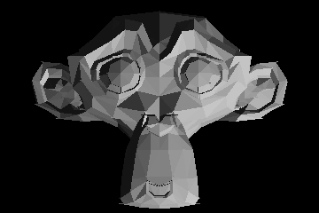

# 3dpy
Rudimentary 3d engine in python for learning purposes

 
 
The Suzanne model included in this repository belongs to the [Blender Project](https://en.wikipedia.org/wiki/Blender_(software)#Suzanne) and is available under the GPLv2+ license.
 

## How does it work?
The magic happens in the render method of the World class, where we render one by one the triangles that make up the shape.
- The 3d coordinates are transformed to the camera frame of reference, multiplying by the camera transformation matrix.
- Each point of the triangle is projected according to the pinhole camera model ( u = fx/z )

Finally we draw the resulting triangles, row by row.
- if the triangle has flat top or flat bottom, we just need to "shade" the pixels between two lines (left and right boundaries of the triangle)
- otherwise we can decompose the triangle in two triangles, one with flat top and one with flat bottom.

The "shader" object decides the color for each pixel. A flat shader will take into account the angle (cosine=dot product) between the light direction and where the 3d triangle is facing.

The z-buffer remembers the z position of what is drawn (distance from the camera plane): we will only draw a pixel if its z coordinate is in the front with respect to what is already drawn.
